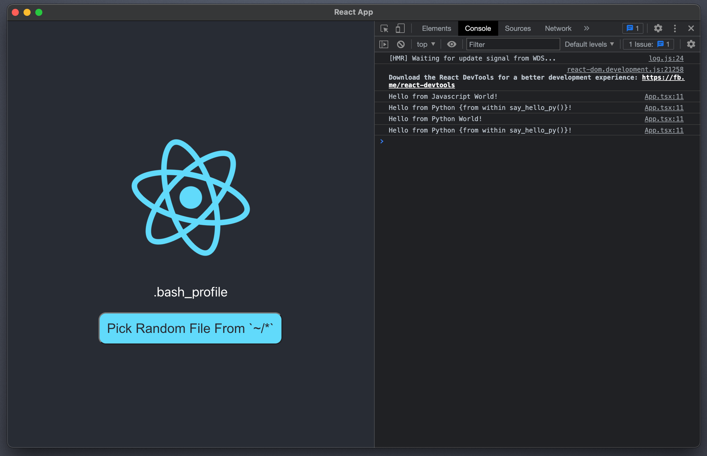

> "Eello World example": Electron + Create-React-App (CRA) and Eel

**Table of Contents**

<!-- TOC -->

- [11 - Electron + CreateReactApp Documentation](#07---createreactapp-documentation)
    - [Quick Start](#quick-start)
    - [About](#about)
    - [Main Files](#main-files)

<!-- /TOC -->

# 11 - Electron + CreateReactApp Documentation

Eello World example Electron +  Create-React-App (CRA) with Eel. This particular project used `07 - CreateReactApp` as a template, which was bootstrapped with `npx create-react-app 07_CreateReactApp --typescript` (Typescript enabled), but the below modifications can be implemented in any CRA configuration or CRA version.

## Quick Start

1. **Configure:** In the app's directory, run `npm install` and `pip install bottle bottle-websocket future whichcraft pyinstaller`. Place Electron.app (can be downloaded using `download_electron.sh`) in the root directory next to eel_Electron_CRA.py
2. **Develop:** Open two prompts. In one, run  `npm start`, and in the other `python eel_electron_CRA.py true`. 
An instance of Electron should open showing your React app, which is running on: [http://localhost:3000/](http://localhost:3000/). As you make changes to the JavaScript in `src/` the browser will reload. But any changes to `eel_electron_CRA.py` will require a restart to take effect. (You may need to refresh the browser window if it gets out of sync with eel).
3. **Distribute:** Fist bundle the React code with `npm run build`. Second, run `npm run build-electron`. (See package.json for full commands). Then build a binary distribution with PyInstaller using:

    `python -m eel eel_electron_CRA.py build --onefile --add-data 'Electron.app:Electron.app' --add-data 'build/electron:build/electron'` 

    (See more detailed PyInstaller instructions at bottom of [the main README](https://github.com/ChrisKnott/Eel)). Valid PyInstaller flags can be passed through, such as including problematic modules with the flag:  --hidden-import module_name. 



## About

> Use `window.eel.expose(func, 'func')` to circumvent `npm run build` code mangling

`npm run build` will rename variables and functions to minimize file size renaming `eel.expose(funcName)` to something like `D.expose(J)`. The renaming breaks Eel's static JS-code analyzer, which uses a regular expression to look for `eel.expose(*)`. To fix this issue, in your JS code, convert all `eel.expose(funcName)` to `window.eel(funcName, 'funcName')`. This workaround guarantees that 'funcName' will be available to call from Python.

## Main Files

Critical files for this demo

- `src/react/App.tsx`: Modified to demonstrate exposing a function from JavaScript and how to use callbacks from Python to update React + Electron GUI.
- `src/electron/main.js`: Entry point of Electron app, which controls the main process and is responsible for controlling your app's lifecycle.
- `eel_electron_CRA.py`: Basic `eel` file
  - If any 2nd argument (i.e. `true`) is provided, the app enables a "development" mode and attempts to connect to the React server on port 3000.
  - If run without arguments, the `eel` script will add `--start-url server_url` to launch a server for the React build in build/ directory (which is ideal for building with PyInstaller/distribution).
- `public/index.html`: Added location of `eel.js` file based on options set in eel_electron_CRA.py

  ```html
  <!-- Loads eel.js from the port specified in the eel.start options -->
  <script type="text/javascript" src="http://localhost:8080/eel.js"></script>
  ```

- `src/react-app-env.d.ts`: This file declares window.eel as a valid type for tslint. Note: capitalization of `window`
- `src/react/App.css`: Added some basic button styling

## Debugging Build

Various things can go wrong during build process, like modules and files failing to be included in the final build. Here's some tips that could help you:
- The `--onefile` flag can be excluded during build. This will generate a directory, instead of a single binary file. Now you can look at the folder structure of your build.
- Note the usage of `resource_path` function in `eel_electron_CRA.py`. It determines base directory, which is different when running source code vs. bundled ("frozen") app. See https://pyinstaller.org/en/stable/runtime-information.html for more details.